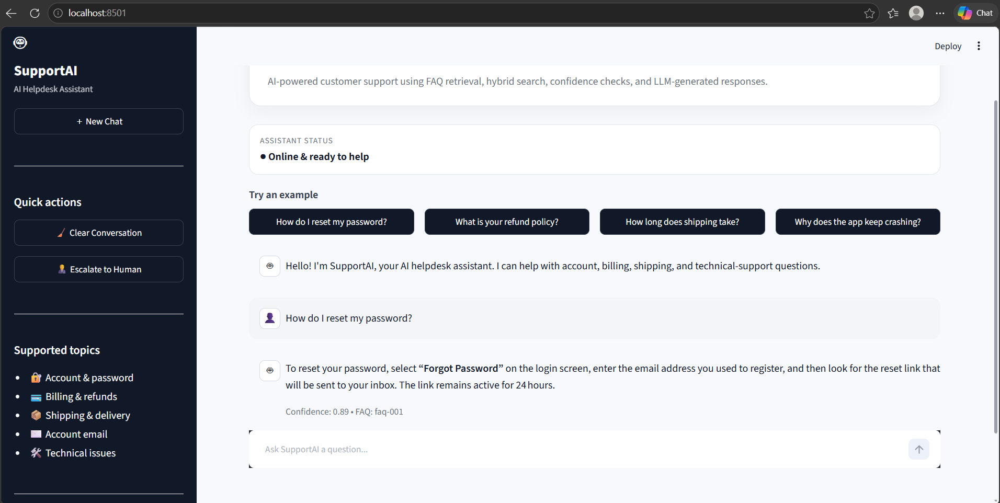

# 🤖 SupportAI — AI Helpdesk Chatbot

A browser-based AI helpdesk assistant that combines **FAQ retrieval, keyword matching, TF-IDF similarity, hybrid search, confidence-based fallback, Groq LLM responses, conversation state, and human-agent escalation** in a professional Streamlit chat interface.

## Demo



> This project is the web-enabled evolution of the original SupportAI command-line helpdesk agent.

## Features

- 💬 Browser-based chatbot interface
- 📚 FAQ knowledge base
- 🔎 Keyword-based retrieval
- 📊 TF-IDF vectorization
- 📐 Cosine similarity
- 🔀 Hybrid retrieval
- 🎯 Confidence-based response selection
- 🤖 Groq-powered LLM response generation
- 🛡️ Fallback handling for unsupported questions
- 💾 Conversation state during the browser session
- 👨‍💼 Human-agent escalation
- 🎫 Simulated support ticket generation
- 🔐 Environment-variable based API-key management
- 🧹 New Chat / Clear Conversation controls
- 🔎 Conversation details and retrieval metadata
- ⚡ Local HTTP web application through Streamlit

---

## 🏗️ Architecture

```text
┌───────────────────────────────┐
│        Browser / User         │
│     Streamlit Chat UI         │
└───────────────┬───────────────┘
                │
                ▼
┌───────────────────────────────┐
│       app.py                  │
│  Presentation / UI Layer      │
└───────────────┬───────────────┘
                │
                ▼
┌───────────────────────────────┐
│       SupportAgent            │
│     supportai.py              │
└───────────────┬───────────────┘
                │
        ┌───────┴────────┐
        ▼                ▼
┌──────────────┐  ┌──────────────┐
│ Keyword      │  │ TF-IDF       │
│ Retrieval    │  │ Similarity   │
└──────┬───────┘  └──────┬───────┘
       └──────────┬───────┘
                  ▼
        ┌──────────────────┐
        │  Hybrid Search   │
        └────────┬─────────┘
                 ▼
        ┌──────────────────┐
        │ Confidence Check │
        └───────┬─────┬────┘
                │     │
        High ───┘     └── Low
          │                 │
          ▼                 ▼
   ┌─────────────┐   ┌─────────────┐
   │ Groq LLM    │   │ Safe        │
   │ Response    │   │ Fallback    │
   └──────┬──────┘   └─────────────┘
          │
          ▼
   ┌────────────────┐
   │ Chat Response  │
   └────────────────┘
```

## 📁 Project Structure

```text
SupportAI-AI-Helpdesk-Chatbot/
│
├── app.py                  # Streamlit browser UI
├── supportai.py            # Core AI/helpdesk engine
├── requirements.txt        # Python dependencies
├── .env.example            # Safe environment-variable template
├── .gitignore              # Git exclusions
└── README.md               # Project documentation
```

### Responsibilities

**`supportai.py`**

- FAQ knowledge base
- Keyword retrieval
- TF-IDF matching
- Cosine similarity
- Hybrid search
- Confidence threshold
- Groq API client
- Conversation state
- Escalation and ticket generation

**`app.py`**

- Browser UI
- Chat messages
- Example prompts
- New Chat
- Clear Conversation
- Human escalation button
- Conversation details
- Confidence / FAQ metadata
- Error handling

This separation keeps the AI/application logic independent from the presentation layer.

---

# 🚀 Run Locally

## 1. Open the project

Open the project folder in VS Code.

Open:

**Terminal → New Terminal**

Make sure the terminal is inside the project directory.

## 2. Create a virtual environment

First time only:

```powershell
python -m venv .venv
```

## 3. Activate the virtual environment

Windows PowerShell:

```powershell
.venv\Scripts\Activate.ps1
```

You should see:

```text
(.venv)
```

at the beginning of your terminal prompt.

## 4. Install dependencies

```powershell
pip install -r requirements.txt
```

## 5. Configure the Groq API key

Create a file named:

```text
.env
```

in the project root.

Add:

```text
GROQ_API_KEY=your_groq_api_key_here
```

Do not commit `.env` to GitHub.

## 6. Start the web application

```powershell
streamlit run app.py
```

Streamlit will start a local HTTP server.

You should see something similar to:

```text
Local URL: http://localhost:8501
```

Open that address in your browser.

You now have the SupportAI chatbot running as a web application.

---

# 🔄 How to run it later

After the first setup, you do NOT need to recreate the virtual environment.

Every time:

```powershell
cd path\to\SupportAI-AI-Helpdesk-Chatbot
```

Activate:

```powershell
.venv\Scripts\Activate.ps1
```

Run:

```powershell
streamlit run app.py
```

Then open:

```text
http://localhost:8501
```

---

# 🧪 Example Questions

Try:

```text
How do I reset my password?
```

```text
What is your refund policy?
```

```text
How long does shipping take?
```

```text
I want to change my email address.
```

```text
Why does the app keep crashing?
```

Also test an unsupported question to verify the fallback behavior.

---

# 🔐 Security

Never hard-code the Groq API key inside Python files.

Use:

```text
.env
```

and keep it out of Git.

The repository should contain:

```text
.env.example
```

but not your real:

```text
.env
```

Before pushing to GitHub, verify:

```powershell
git status
```

and make sure `.env` is not listed as a file to commit.

---

# 🛠️ Technology Stack

| Layer         | Technology                     |
| ------------- | ------------------------------ |
| Language      | Python                         |
| Web UI        | Streamlit                      |
| LLM           | Groq API                       |
| Retrieval     | Keyword + TF-IDF               |
| Similarity    | Cosine Similarity              |
| ML/NLP        | Scikit-learn                   |
| API requests  | Requests                       |
| Configuration | python-dotenv                  |
| Interface     | Browser-based HTTP application |

---

# 📌 Current FAQ Knowledge Base

The current engine contains example support topics:

| FAQ     | Category  | Topic                |
| ------- | --------- | -------------------- |
| faq-001 | Account   | Password reset       |
| faq-002 | Billing   | Refund policy        |
| faq-003 | Shipping  | Shipping time        |
| faq-004 | Account   | Update email         |
| faq-005 | Technical | Application crashing |

---

# 🧠 How the AI Response Pipeline Works

1. User submits a message through the Streamlit chat UI.
2. `app.py` sends the message to `SupportAgent`.
3. Keyword retrieval identifies relevant FAQ candidates.
4. TF-IDF converts FAQ text and the query into numerical vectors.
5. Cosine similarity measures semantic similarity.
6. Hybrid search combines retrieval signals.
7. A confidence threshold determines whether a reliable FAQ match exists.
8. For a confident match, the relevant FAQ is supplied to the Groq LLM.
9. The LLM generates a natural-language response grounded in the FAQ.
10. For low-confidence questions, the agent uses a fallback instead of inventing an answer.
11. Repeated unsupported questions can lead to human escalation.
12. The browser displays the answer and retrieval metadata.

---

# 🎯 Portfolio Highlights

This project demonstrates:

- AI-powered customer support
- Natural Language Processing
- Information Retrieval
- TF-IDF vectorization
- Cosine similarity
- Hybrid search
- LLM API integration
- Prompt engineering
- Confidence-based routing
- Fallback handling
- Conversational state management
- Human-agent escalation
- Environment-based secret management
- Python application architecture
- Streamlit web application development

---

# 🔮 Future Enhancements

Potential next steps:

- Persistent conversation database
- User authentication
- Larger FAQ/document knowledge base
- Embedding-based semantic search
- FAISS/Chroma vector database
- RAG over uploaded documents
- Ticket database
- Admin dashboard
- Analytics
- Multilingual support
- Automated FAQ generation
- Evaluation dataset and retrieval metrics
- FastAPI backend
- React frontend
- Docker deployment
- Cloud deployment

---

## 👩‍💻 Author

**Pravallika**

B.Tech — Computer Science and Engineering

---

## 📄 License

Add a license to the repository if you intend to distribute the project publicly.
